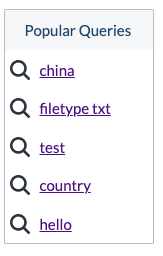

# PopularQueries

Disclaimer: This component was built by the community at large and is not an official Coveo JSUI Component. Use this component at your own risk.

## Description

This component can be used to display popular queries. It does this by making a call to query suggest with an empty string parameter which usually returns queries that are
trending. A `Pipeline` and `SearchHub` can be set as well as th `Title` displayed in the header and the maximum number of results to show.

## Component Options

| Option | Default |
|------  | ------- |
| title  | 'Popular Queries' |
| searchHub | 'default' |
| pipeline | 'default'  |
| count | 5 |

## Screenshot



## Getting Started

1. Install the component into your project.

```
npm i @coveops/popular-queries
```

2. Use the Component or extend it

Typescript:

```javascript
import { PopularQueries, IPopularQueriesOptions } from '@coveops/popular-queries';
```

Javascript

```javascript
const PopularQueries = require('@coveops/popular-queries').PopularQueries;
```

3. You can also expose the component alongside other components being built in your project.

```javascript
export * from '@coveops/popular-queries'
```

4. Or for quick testing, you can add the script from unpkg

```html
<script src="https://unpkg.com/@coveops/popular-queries@latest/dist/index.min.js"></script>
```

> Disclaimer: Unpkg should be used for testing but not for production.

5. Include the component in your template as follows:

Place the component in your markup:

```html
<div class="CoveoPopularQueries"></div>
```


## Extending

Extending the component can be done as follows:

```javascript
import { PopularQueries, IPopularQueriesOptions } from "@coveops/popular-queries";

export interface IExtendedPopularQueriesOptions extends IPopularQueriesOptions {}

export class ExtendedPopularQueries extends PopularQueries {}
```

## Contribute

1. Clone the project
2. Copy `.env.dist` to `.env` and update the COVEO_ORG_ID and COVEO_TOKEN fields in the `.env` file to use your Coveo credentials and SERVER_PORT to configure the port of the sandbox - it will use 8080 by default.
3. Build the code base: `npm run build`
4. Serve the sandbox for live development `npm run serve`